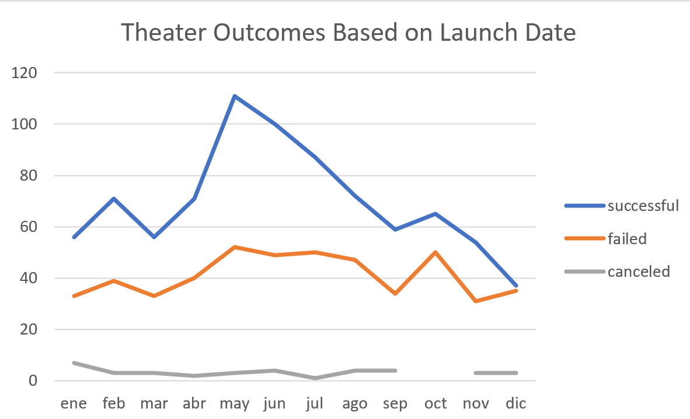
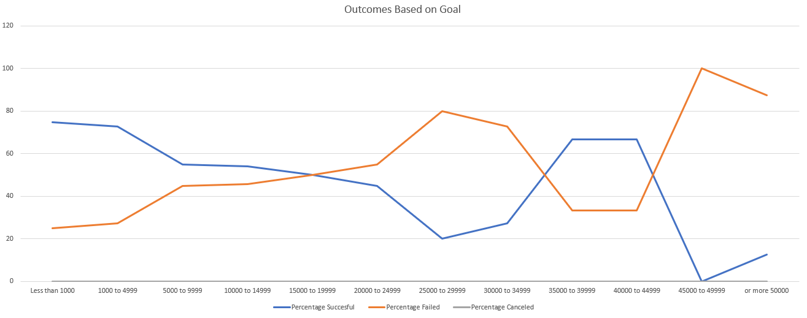

# Kickstarting with Excel

## Overview of Project
### Purpose
Given the kickstarter data file. Louis wants to know if there is a fared relation between launch dates and funding goals for the campaigns. As she came close to her 
foundraising goal in short amount of time for her play _fever_.

## Analysis and Challenges
### Analysis of Outcomes Based on Launch Date

The bigger number of campaigns launched by month where May, June and July. May had a 12.13% Launched with 67% success 31% failed and 2% canceled campaigns. 
June had a 11.18% Launched with 65% success 32% failed and 3% canceled campaigns. July had a 10.08% Launched with 63% success 36% failed and 1% canceled campaigns.

The worst months to Launch a campaign are March, November and December.

#### Challenges and Difficulties Encountered
On Analysis and Outcomes Based on Launch Date.
One of the challenges that I faced was just putting 3 outcomes (successful, failed and canceled) on the chart. Then I remembered that you could filter 
pivot tables as well.

### Analysis of Outcomes Based on Goals

This chart I graphed the % of plays by its outcome; successful, failed and canceled, each outcome divided by goal rages.  

#### Challenges and Difficulties Encountered
The difficulty that I encountered in this exercise was the number of campaigns for successful, failed and canceled didn’t add up some where missing. I decided to
include the equal sign (=) in the formula for the ranges set on goals. Then there where mora number of campaigns. I decided to take a good look and understand what
was going on, then I realized that bye putting = first and second formulas of a column the campaigns where repeating so I just left it in the second formula 
(1000 to 4999) not in the first one (less than 1000).

## Results

- What are two conclusions you can draw about the Outcomes based on Launch Date?
1. May is the best launch date month
2. December is the worst month to launch a campaign

- What can you conclude about the Outcomes based on Goals? 
1. Campaigns with less than 1000 goal **succeed 75%** and has the higher number of campaigns
2. the higher number of **failed** campaigns goals range is 1000 to 4999.

- What are some limitations of this dataset?
1. One possibility that I would like to know is does the category blurb affects the successful campaigns, but there is no way of knowing because the blurb does 
not have sub categories like age intended, drama, action ect. 

- What are some other possible tables and/or graphs that we could create?
1. Successful campaigns depending on the country and on their goal 
2. Failed campaigns depending on the country and on their goal
